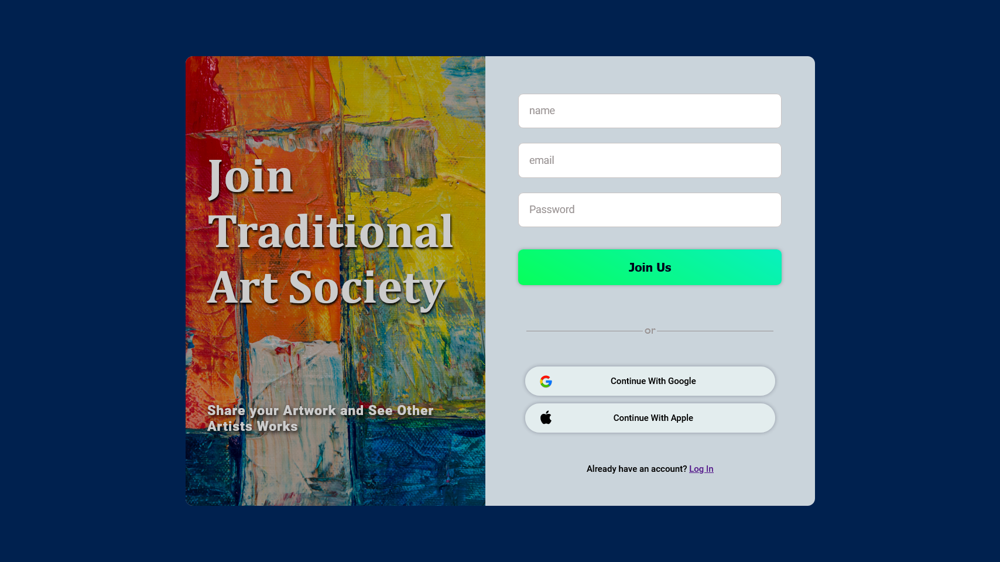
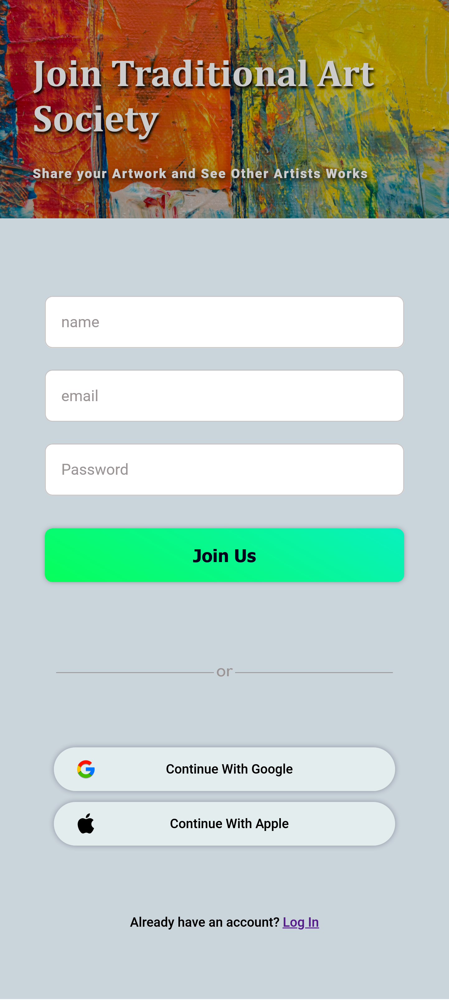
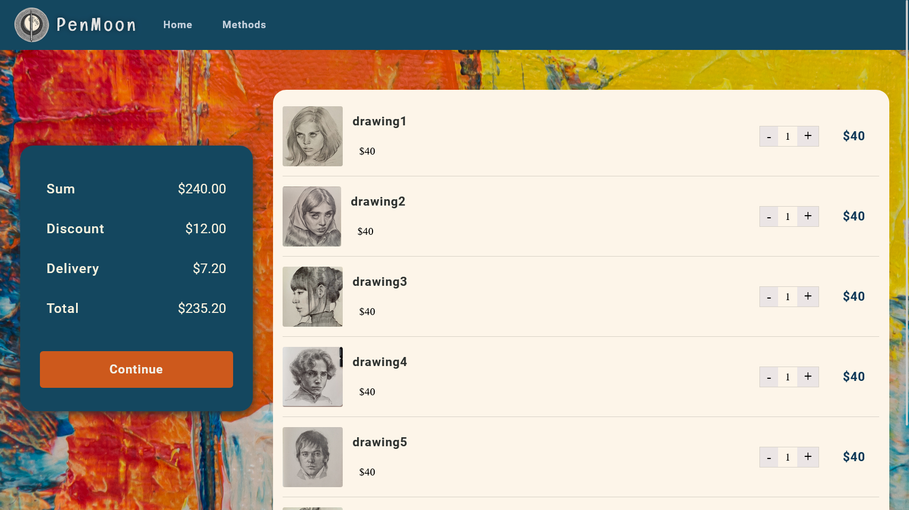
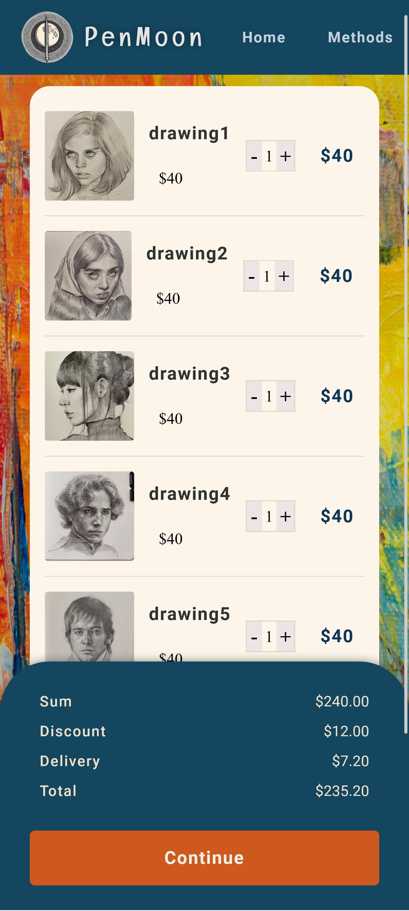
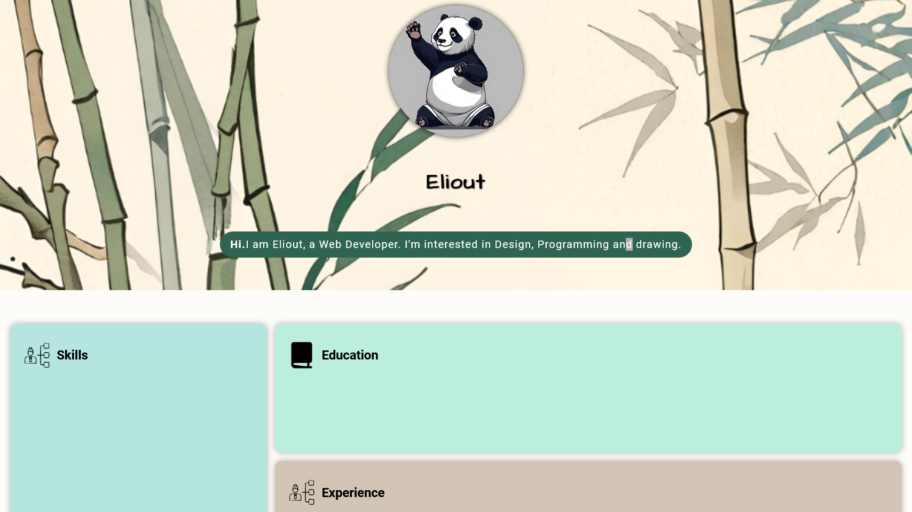
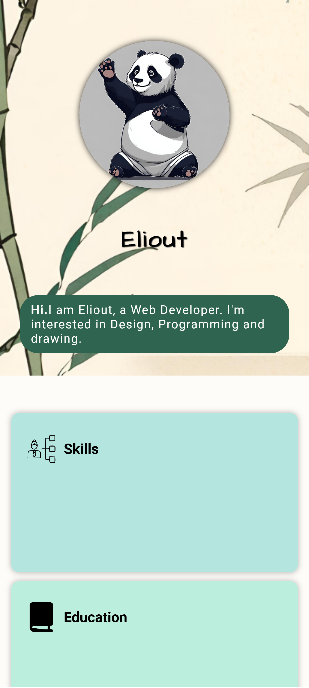
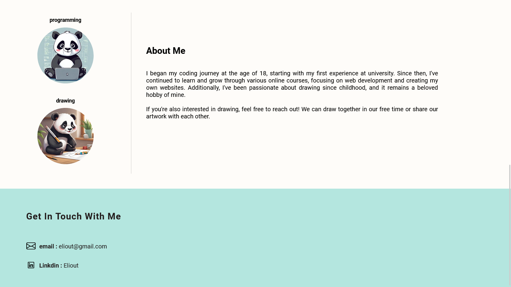
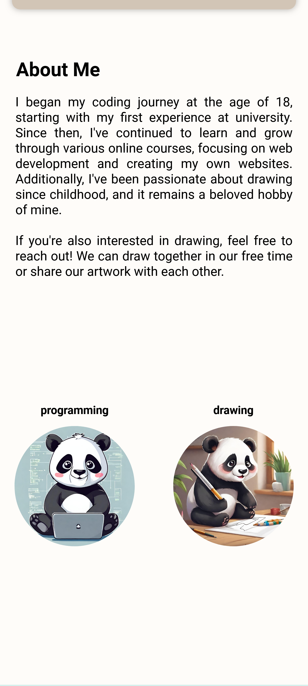
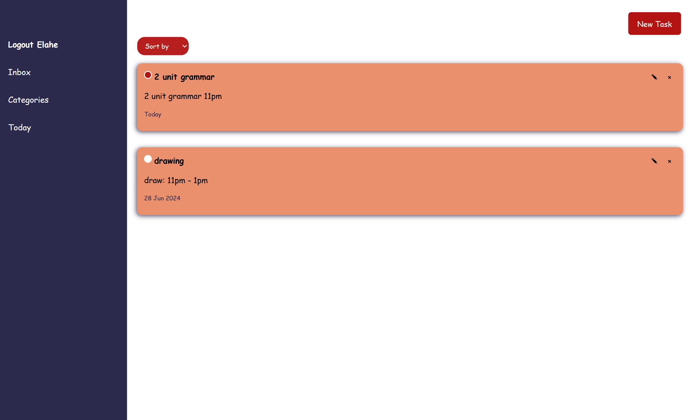

# Extracurricular-projects-summer2023

## Contents

### `001-SignUp`

This directory contains a signup page design implemented using HTML and CSS.

    
    

### `002-ShoppingCart`

In this directory, you'll find a simple shopping cart page design.

    
    

### `003-Portfolio`

Here lies a portfolio design showcasing various projects and works.

    
    

Also

    
    

### `004-ToDo`

This directory hosts a Django project for a todo list application.

    

